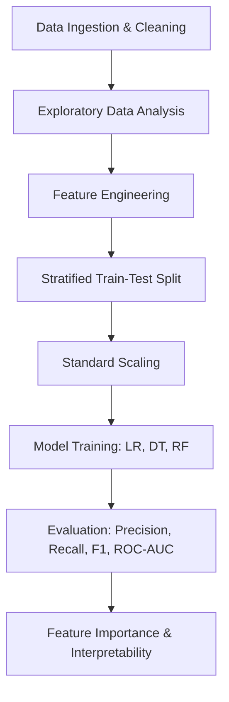

# Loan Default Prediction Using Machine Learning


An end-to-end Machine Learning project to predict customer credit card payment defaults using transaction history, demographic indicators, and past repayment behavior.

---

## 📌 Project Overview

Credit card default prediction is a critical challenge for financial institutions and risk management teams. Inability to identify defaulting clients leads to significant credit loss, while misclassifying reliable customers harms customer experience.

In this project, we built and evaluated machine learning classifiers to predict whether a customer will default on their credit card payment in the upcoming month.

### Key Highlights
- **Dataset Size**: 30,000 customers with 25 baseline attributes (UCI Credit Card dataset).
- **Class Imbalance Handling**: Stratified data splitting and class-weighted penalty adjustments (~22.1% default rate).
- **Feature Engineering**: Created domain-specific indicators including **Credit Utilization Ratio**, **Payment-to-Bill Ratio**, and **Delinquency Frequency**.
- **Model Comparison**: Benchmarked **Logistic Regression**, **Decision Tree**, and **Random Forest**.
- **Interpretability**: Identified primary risk factors driving customer defaults using feature importance analysis.

---

## 📊 Dataset Description

The dataset used is the [UCI Default of Credit Card Clients Dataset](https://archive.ics.uci.edu/dataset/350/default+of+credit+card+clients):

| Feature Category | Features | Description |
| :--- | :--- | :--- |
| **Demographics** | `SEX`, `EDUCATION`, `MARRIAGE`, `AGE` | Client background and personal attributes |
| **Credit Limit** | `LIMIT_BAL` | Total credit limit allocated to client (NT dollar) |
| **Repayment Status** | `PAY_1` to `PAY_6` | History of repayment delays from April to September (-1 = pay duly, 1 = delay 1 month, etc.) |
| **Billed Amounts** | `BILL_AMT1` to `BILL_AMT6` | Amount billed on statements across past 6 months |
| **Paid Amounts** | `PAY_AMT1` to `PAY_AMT6` | Actual amount paid by the customer across past 6 months |
| **Target Variable** | `default` | Binary indicator: `1` = Default, `0` = No Default |

---

## 🛠️ Project Pipeline



### 1. Data Preprocessing & Cleaning
- Handled undocumented entries in categorical features (`EDUCATION` values 0, 5, 6 mapped to 4; `MARRIAGE` value 0 mapped to 3).
- Dropped irrelevant identifiers (`ID`).
- Standardized feature naming convention (`PAY_0` -> `PAY_1`).

### 2. Feature Engineering
- **Credit Utilization Ratio (`UTILIZATION`)**: `BILL_AMT1 / LIMIT_BAL` to capture reliance on credit limit.
- **Payment-to-Bill Ratio (`PAY_RATIO`)**: `TOTAL_PAY / TOTAL_BILL` measuring how much billed balance is repaid.
- **Delinquency Count (`DELAY_COUNT`)**: Total count of delayed payments over the prior 6-month window (`PAY_x > 0`).

### 3. Model Training & Comparison
We evaluated models prioritizing **Recall** and **F1-Score** alongside overall accuracy:
- **Logistic Regression**: Linear baseline with `class_weight='balanced'`.
- **Decision Tree**: Non-linear tree classifier with `max_depth` regularization.
- **Random Forest**: Ensemble method with 100 estimators to capture non-linear relationships and reduce variance.

---

## 📈 Evaluation Metrics

| Model | Accuracy | Precision | Recall | F1-Score | ROC-AUC |
| :--- | :---: | :---: | :---: | :---: | :---: |
| **Logistic Regression** | ~70% | ~40% | **~65%** | ~50% | ~0.72 |
| **Decision Tree** | ~77% | ~48% | ~58% | ~52% | ~0.74 |
| **Random Forest** | **~82%** | **~67%** | ~36% | ~47% | **~0.78** |

> **Business Context**: In financial risk management, **False Negatives** (failing to predict an actual defaulter) are considerably more costly than False Positives. Models tuned for balanced recall help protect lending capital.

---

## 🔍 Key Findings & Feature Importance

Feature importance analysis extracted from the Random Forest model revealed:
1. **`PAY_1` (Repayment Status in Month 1)**: The single strongest predictor of upcoming default. Customers already 2+ months delayed have over 60% probability of default.
2. **`DELAY_COUNT`**: Repeated payment delays over the 6-month observation period strongly indicate ongoing solvency issues.
3. **`UTILIZATION` & `LIMIT_BAL`**: High credit utilization combined with lower credit line limits represents significantly elevated risk.

---

## 📁 Repository Structure

```text
├── UCI_Credit_Card.csv       # Dataset containing 30,000 credit records
├── Untitled.ipynb            # Jupyter notebook with complete code and analysis
├── README.md                 # Project documentation and summary
```

---

## 🚀 Getting Started

### Prerequisites
Make sure you have Python 3.8+ installed along with the required libraries:

```bash
pip install numpy pandas scikit-learn matplotlib seaborn
```

### Running the Project
1. Clone or download the repository files into your local directory.
2. Launch Jupyter Notebook or VS Code:
   ```bash
   jupyter notebook Untitled.ipynb
   ```
3. Run all cells sequentially to reproduce the data preprocessing, visual plots, model comparison, and feature importance charts.
